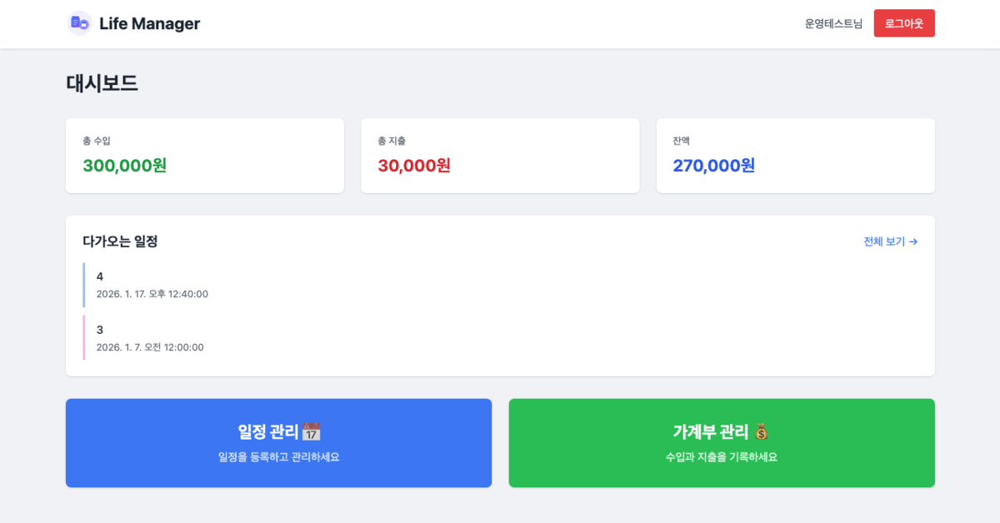
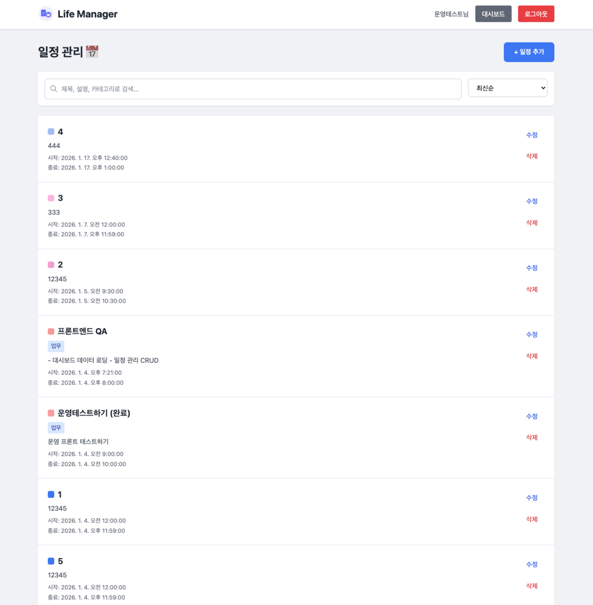
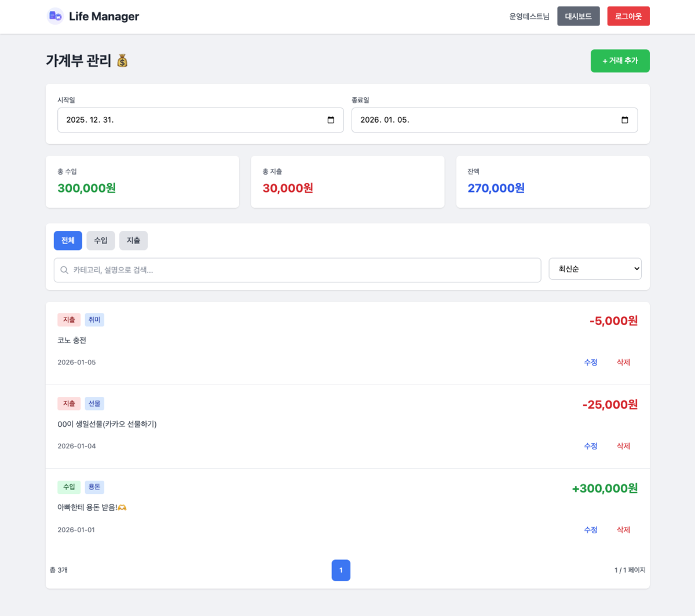
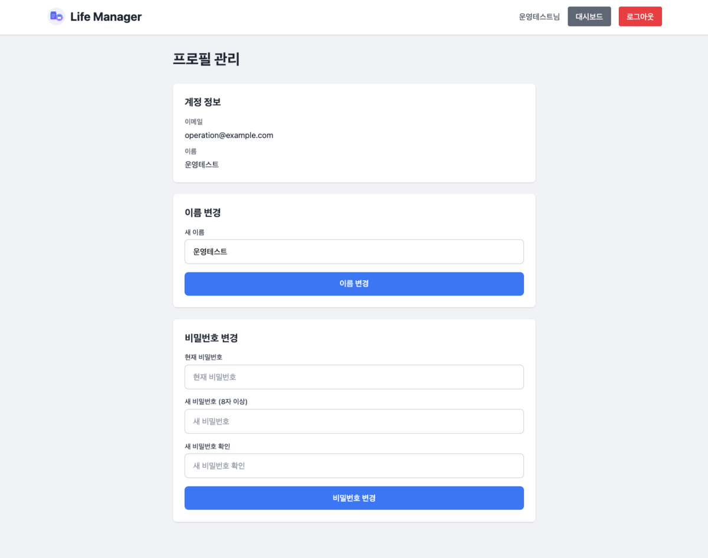

# 🗓️ Life Manager - Frontend

> 일정과 가계부를 한 번에 관리하는 통합 라이프 매니저 웹 애플리케이션

[](https://reactjs.org/)
[](https://tailwindcss.com/)
[](https://vercel.com/)

## 📌 프로젝트 소개

Life Manager는 개인의 일정과 금전 관리를 하나의 플랫폼에서 통합 관리할 수 있는 웹 애플리케이션입니다.
직관적인 UI/UX와 반응형 디자인으로 모바일과 데스크톱 모두에서 편리하게 사용할 수 있습니다.

**🌐 라이브 데모**: https://life-manager-frontend-ruddy.vercel.app

---

## ✨ 주요 기능

### 🔐 인증

- 회원가입 / 로그인
- JWT 기반 토큰 인증
- 로그아웃 확인 모달

### 📊 대시보드

- 다가오는 일정 미리보기
- 이번 달 수입/지출 요약
- 빠른 메뉴 접근

### 📅 일정 관리

- ✅ 일정 CRUD (생성, 조회, 수정, 삭제)
- 🔍 검색 기능 (제목, 설명, 카테고리)
- 🔢 정렬 (날짜, 제목)
- 📄 페이지네이션 (10개씩)
- 🎨 색상 태그
- 🏷️ 카테고리 분류
- 📅 종일 일정 자동 시간 설정

### 💰 가계부 관리

- ✅ 수입/지출 기록 관리
- 📅 기간별 조회
- 💵 수입/지출/잔액 실시간 요약
- 🔍 검색 & 필터 (타입별)
- 🔢 정렬 (날짜, 금액)
- 📄 페이지네이션

### 👤 프로필

- 이름 변경
- 비밀번호 변경

---

## 🛠️ 기술 스택

### Core

- **React 18** - UI 라이브러리
- **React Router v6** - 라우팅
- **Axios** - HTTP 클라이언트

### Styling

- **Tailwind CSS 3.4** - 유틸리티 CSS 프레임워크
- **반응형 디자인** - 모바일/태블릿/데스크톱 지원

### State Management

- **React Hooks** - 상태 관리
- **Custom Hooks** - 재사용 로직 (useAuth, useFetch, useForm)

### Development

- **Create React App** - 프로젝트 설정
- **ESLint** - 코드 린팅

### Deployment

- **Vercel** - 자동 배포 & 호스팅
- **환경 변수** - API URL 관리

---

## 📁 프로젝트 구조

```
src/
├── assets/              # 정적 파일
│   ├── logo.svg
│   └── favicon.ico
├── components/          # 재사용 컴포넌트
│   ├── Header.js
│   ├── Loading.js
│   ├── ErrorModal.js
│   ├── Toast.js
│   ├── ConfirmModal.js
│   └── Pagination.js
├── hooks/              # 커스텀 훅
│   ├── useAuth.js
│   ├── useFetch.js
│   ├── useForm.js
│   └── index.js
├── pages/              # 페이지 컴포넌트
│   ├── LoginPage.js
│   ├── DashboardPage.js
│   ├── SchedulesPage.js
│   ├── TransactionsPage.js
│   └── ProfilePage.js
├── services/           # API 서비스
│   └── api.js
├── App.js             # 메인 앱
└── index.js           # 엔트리 포인트
```

---

## 🚀 시작하기

### 필수 요구사항

- Node.js 16 이상
- npm 또는 yarn

### 환경 변수 설정

`.env` 파일 생성:

```env
REACT_APP_API_URL=https://life-manager.duckdns.org/api
```

### 로컬 실행

```bash
# 1. 저장소 클론
git clone https://github.com/panda981018/life-manager-frontend.git
cd life-manager-frontend

# 2. 의존성 설치
npm install

# 3. 개발 서버 실행
npm start
```

앱은 `http://localhost:3000`에서 실행됩니다.

### 빌드

```bash
npm run build
```

---

## 🎨 주요 화면

### 📱 모바일 최적화

- 반응형 레이아웃
- 터치 최적화 (최소 44px)
- 축약된 헤더 (LM)
- 세로 스크롤 최적화

### 💻 데스크톱

- 넓은 화면 레이아웃
- 마우스 호버 효과
- 키보드 단축키 지원

---

## ⚡ 성능 최적화

- **코드 스플리팅**: React.lazy (준비 중)
- **이미지 최적화**: WebP 포맷
- **API 캐싱**: 중복 요청 방지
- **환경 변수**: API URL 분리
- **에러 바운더리**: 전역 에러 처리

---

## 🎯 UX 개선

### Toast 알림

- ✅ 성공 알림 (초록색)
- ❌ 에러 알림 (빨간색)
- ⚠️ 경고 알림 (노란색)
- 자동 닫힘 (3초)

### 로딩 상태

- 전체 화면 로딩 오버레이
- 버튼 비활성화 처리
- "처리 중..." 텍스트

### 에러 처리

- 재시도 버튼 제공
- 사용자 친화적 에러 메시지
- 401 에러 시 자동 로그아웃

### 입력 검증

- 실시간 검증
- 시각적 피드백
- 명확한 에러 메시지

---

## 🔧 커스텀 훅

### useAuth

```javascript
const { userId, userName, isAuthenticated, login, logout, checkAuth } =
  useAuth();
```

### useFetch

```javascript
const { data, isLoading, error, refetch } = useFetch(apiCall);
```

### useForm

```javascript
const { values, handleChange, resetForm, setFieldValue } =
  useForm(initialValues);
```

---

## 🌐 API 연동

모든 API 요청은 `src/services/api.js`에서 관리됩니다.

- **JWT 자동 추가**: Axios 인터셉터
- **에러 처리**: 401 자동 로그아웃
- **환경 변수**: API URL 분리

---

## 📱 반응형 브레이크포인트

| 크기 | 범위   | 설명            |
| ---- | ------ | --------------- |
| sm   | 640px  | 모바일 (가로)   |
| md   | 768px  | 태블릿          |
| lg   | 1024px | 데스크톱 (작은) |
| xl   | 1280px | 데스크톱 (큰)   |

---

## 🚢 배포

### Vercel 자동 배포

`main` 브랜치에 푸시하면 자동으로 배포됩니다.

### 수동 배포

```bash
# Vercel CLI 설치
npm i -g vercel

# 배포
vercel --prod
```

---

## 🤝 기여

이 프로젝트는 개인 포트폴리오 프로젝트입니다.

---

## 📝 라이선스

이 프로젝트는 개인 학습 목적으로 만들어졌습니다.

---

## 👨‍💻 개발자

**panda981018** - [GitHub](https://github.com/panda981018)

---

## 🔗 관련 링크

- [백엔드 저장소](https://github.com/panda981018/life-manager)
- [백엔드 API](https://life-manager.duckdns.org)

---

## 🤖 개발 프로세스

이 프로젝트는 **AI와의 협업을 통해 개발 워크플로우를 학습**하는 것을 목표로 했습니다.

### 백엔드 (Spring Boot)

- ✅ **직접 개발**: 전체 아키텍처 설계, API 설계, 비즈니스 로직 구현
- ✅ **핵심 역량**: Spring Boot, JPA, JWT 인증, PostgreSQL, AWS 배포

### 프론트엔드 (React)

- 🤝 **AI 협업**: Claude AI의 도움을 받아 React 컴포넌트 작성
- ✅ **주도적 역할**:
  - 모든 기능 요구사항 정의 및 명세
  - UI/UX 개선 방향 결정
  - 코드 리뷰 및 수정 요청
  - 버그 발견 및 해결 방안 제시
- ✅ **학습 성과**: React Hooks, 상태 관리, API 연동, 반응형 디자인 이해

### 협업 도구

- **GitHub** - 버전 관리 및 CI/CD
- **Claude AI** - 프론트엔드 개발 지원
- **AWS/Vercel** - 배포 및 운영

---

## 📸 스크린샷

### 대시보드



### 일정 관리



### 가계부 관리



### 프로필 관리



---

## 🎓 학습 내용

이 프로젝트를 통해 다음을 학습했습니다:

- ✅ React Hooks를 활용한 상태 관리
- ✅ 커스텀 훅을 통한 로직 재사용
- ✅ JWT 기반 인증 구현
- ✅ RESTful API 연동
- ✅ Tailwind CSS를 활용한 반응형 디자인
- ✅ 사용자 경험(UX) 개선
- ✅ 에러 처리 & 로딩 상태 관리
- ✅ 페이지네이션 구현
- ✅ 검색 & 정렬 기능
- ✅ Vercel 배포 자동화
- ✅ AI 협업을 통한 효율적인 개발 워크플로우
